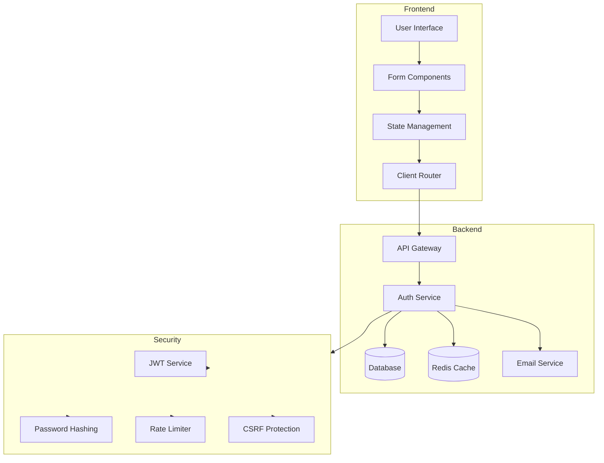
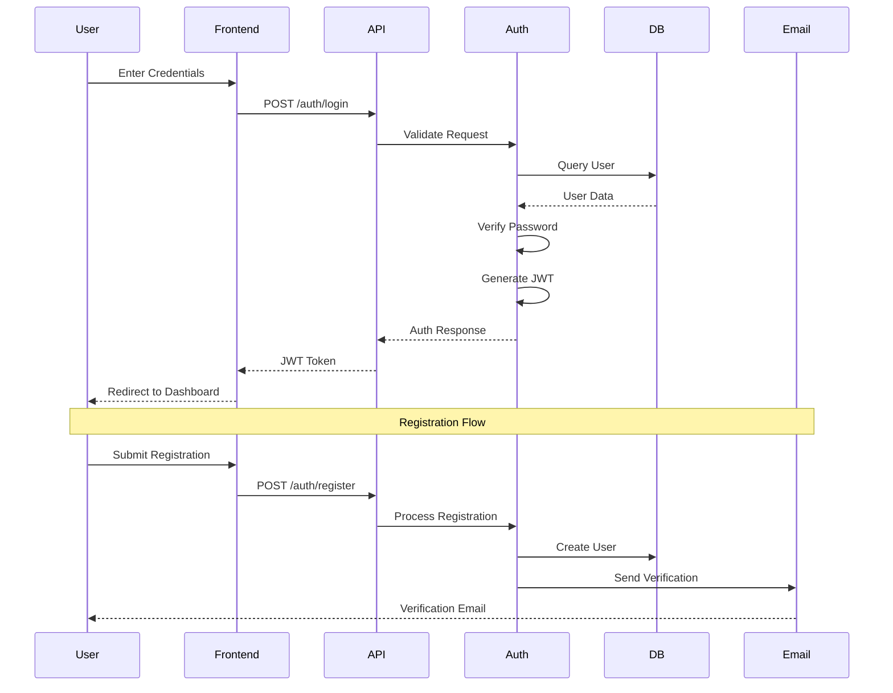
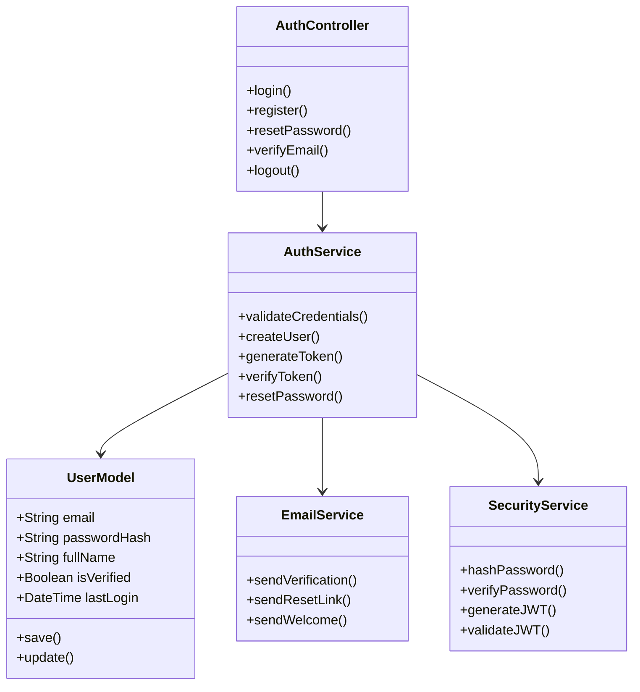
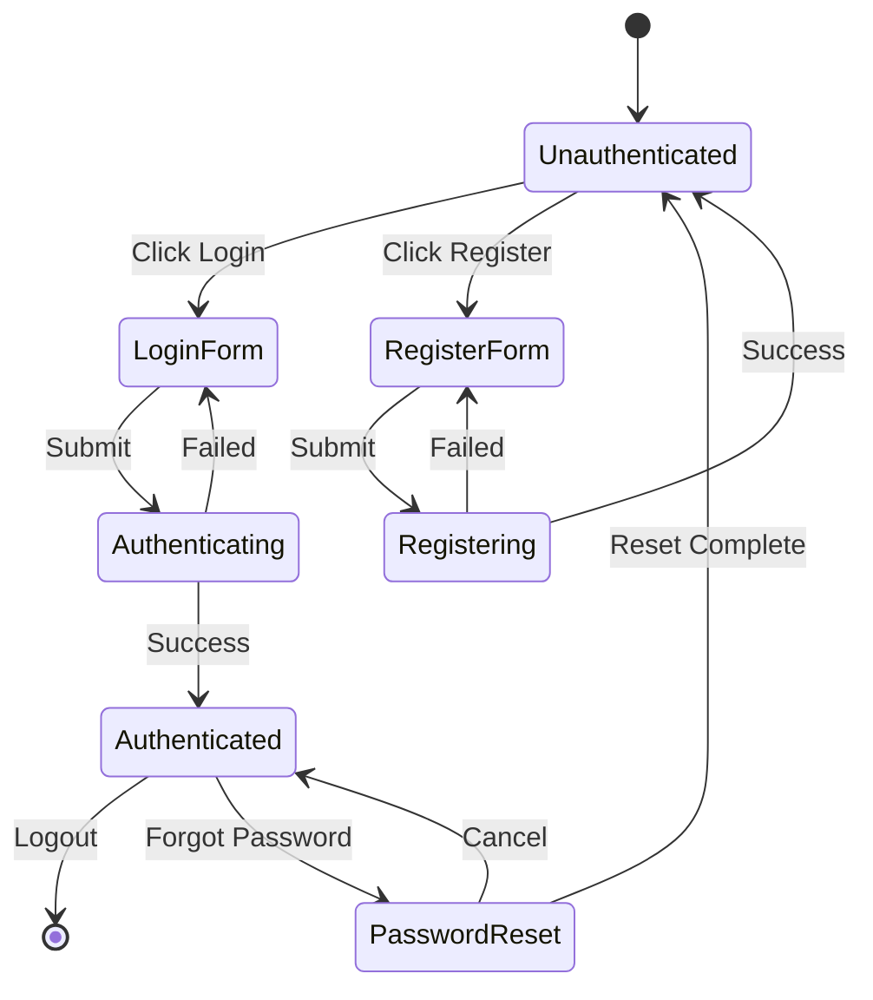
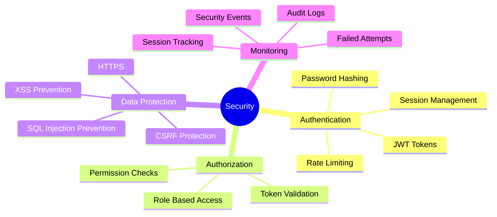
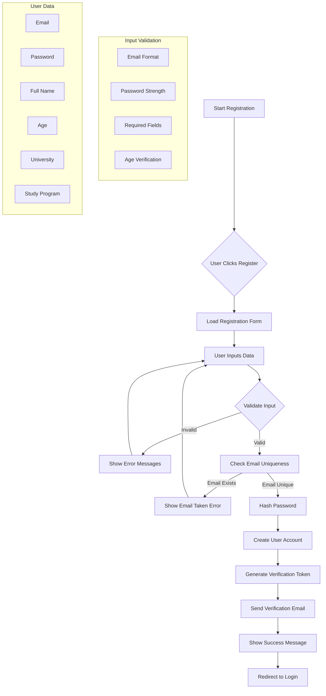
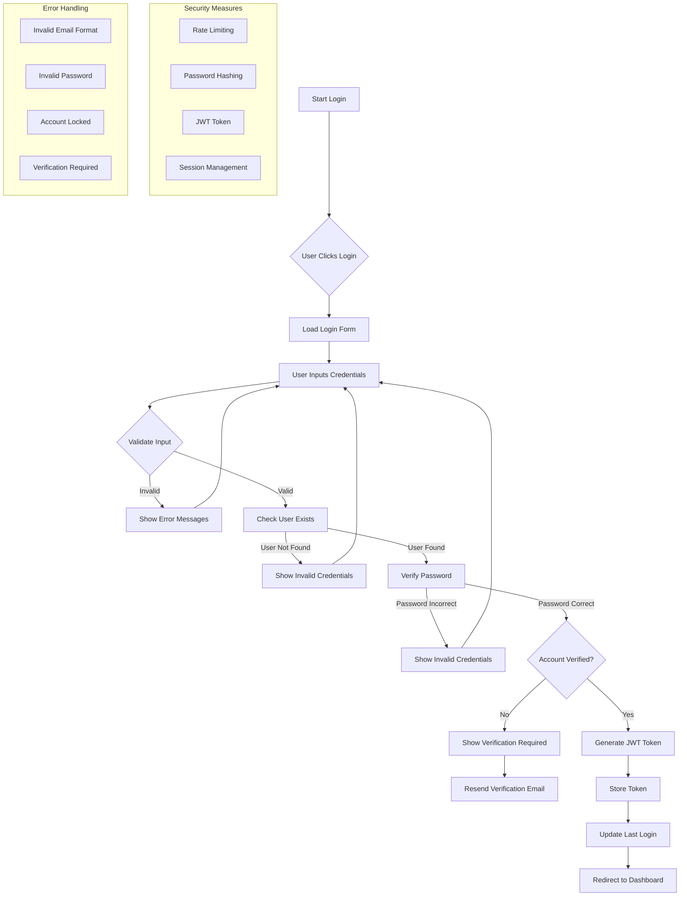
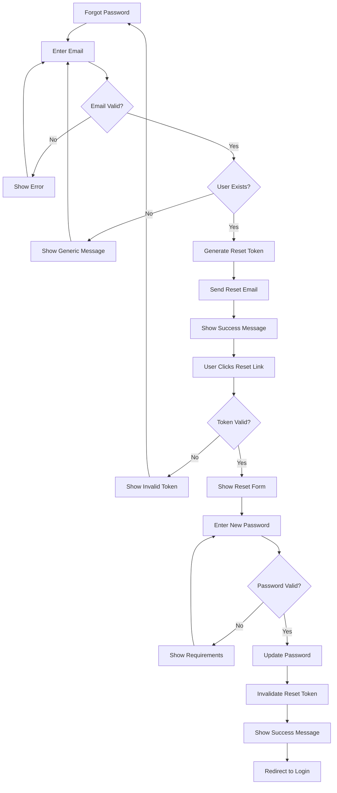
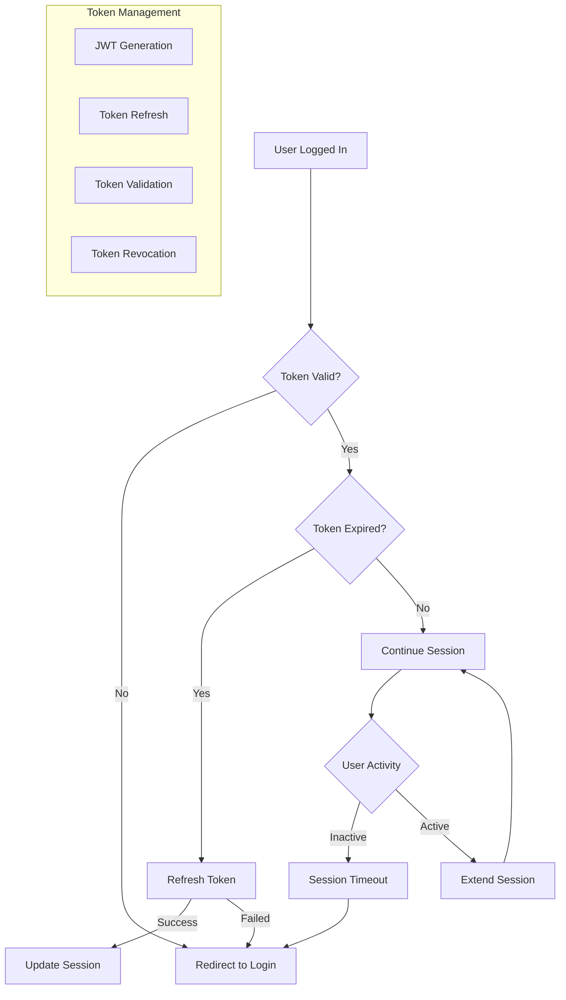

# Authentication Flow Documentation

## System Architecture Overview

## Data Flow Diagram

## Component Relationships

## State Management Flow

## Security Layers

## Registration Process

## Login Process

## Password Reset Flow

## Session Management

## Notes

1. **Security Considerations:**
   - All passwords are hashed using bcrypt
   - JWT tokens have a short expiration time
   - Rate limiting is implemented for login attempts
   - CSRF protection is enabled
   - All sensitive data is transmitted over HTTPS

2. **Validation Rules:**
   - Email must be a valid university email
   - Password must be at least 8 characters
   - Password must contain uppercase, lowercase, number, and special character
   - Username must be 3-20 characters
   - Age must be 18 or older

3. **Error Handling:**
   - Generic error messages for security
   - Detailed validation errors for user input
   - Proper logging of security events
   - Rate limiting notifications

4. **User Experience:**
   - Clear error messages
   - Progress indicators
   - Responsive design
   - Remember me functionality
   - Password strength indicator

5. **System Architecture:**
   - Microservices-based architecture
   - Separate authentication service
   - Redis for session management
   - PostgreSQL for user data
   - SMTP service for emails

6. **Component Details:**
   - Frontend: React with TypeScript
   - Backend: Spring Boot
   - Database: PostgreSQL
   - Cache: Redis
   - Email: SendGrid
   - Security: Spring Security

7. **Deployment:**
   - Docker containers
   - Kubernetes orchestration
   - CI/CD pipeline
   - Automated testing
   - Monitoring and logging 